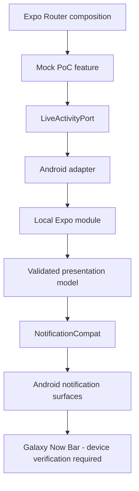

# Architecture

## 현재 범위

Phase 1은 사용자가 시작한 mock 이동 알림을 공개 Android API로 게시하는 PoC다.
위치 수집, 대중교통 API, 백그라운드 scheduler는 아직 없다.
Now Bar의 실제 표시는 Android 버전뿐 아니라 Samsung의 정책·사용자 설정에 영향을 받는다.
OS 승격 플래그만으로 Now Bar 검증 성공을 선언하지 않는다.

## FSD

의존 방향은 `app → pages → widgets → features → entities → shared`다.
현재 사용하지 않는 계층은 빈 scaffolding으로 만들지 않는다.

- `src/app/`: Expo Router 경로·루트 layout·의존성 조립. 모든 파일이 route여야 한다.
- `src/features/now-bar-poc/`: mock 표시 데이터, 수동 진행, 화면 상태와 조작 UI.
- `src/shared/platform/live-activity/`: 플랫폼 중립 port, 입력 검증, typed error, Android adapter.
- `modules/live-update/`: Expo 원시 binding과 Kotlin 모듈. 플랫폼 어댑터에서만 접근한다.

Feature는 `LiveActivityPort`를 전달받고 원시 네이티브 binding을 import하지 않는다.
네이티브 Kotlin 모델은 Android notification 객체와 별개로 입력·상태 전이를 검증한다.
순환 의존, 상위 계층 import, 같은 계층의 다른 slice 직접 참조, public API 우회는
dependency-cruiser가 CI에서 실패시킨다.

## 데이터 흐름

일반 업데이트는 무음이며 approaching·arrived fixture만 alert를 요청한다.
소리·진동·잠금 화면 표시는 사용자 알림 설정에 따른다.

## 후속 단계

제품의 domain state machine(IDLE / PREPARING / TRACKING / APPROACHING / ARRIVED /
COMPLETED / ERROR / PAUSED / CANCELLED)은 Phase 2에서 구현한다.
현재 tracking / approaching / arrived는 알림 표시 상태다.
이 구현을 실제 TransitTrip 구현 완료로 취급하지 않는다.

## Sources

- [Expo SDK 57 reference](https://docs.expo.dev/versions/v57.0.0/)
- [Expo Router installation](https://docs.expo.dev/router/installation/)
- [Live Updates requirements](https://developer.android.com/develop/ui/views/notifications/live-update)
